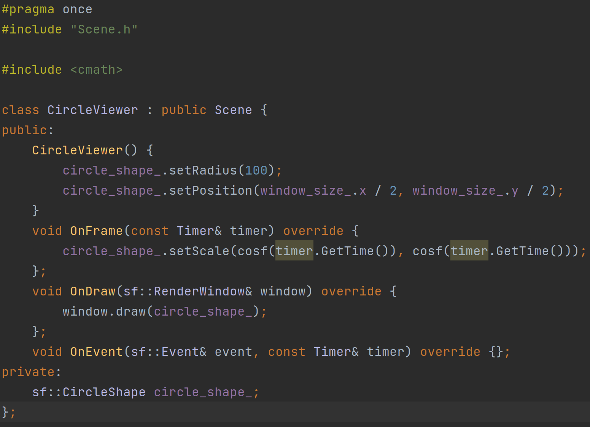
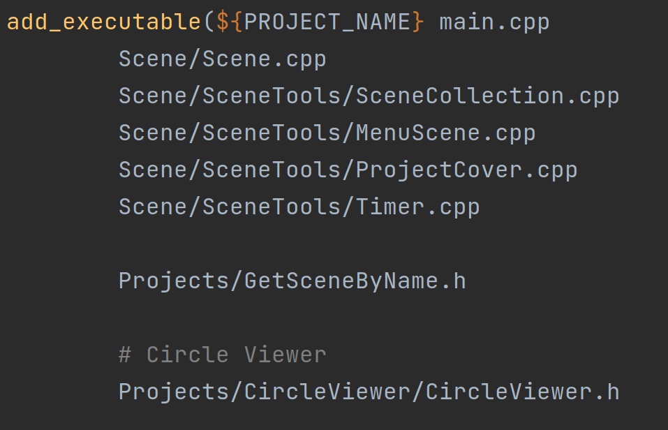
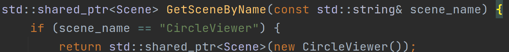
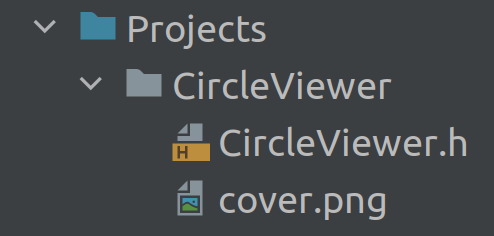

# SFML-Collection
Lets do a collection!
***
Build of last commit in main branch: [on dropbox](https://www.dropbox.com/sh/zzn6048h0n7gg5i/AAA5sE099mS7MMxqnawf9D7da?dl=0) 

## How to build
Program builds with CMake

installing libraries on linux:
    sudo apt install libxrandr-dev libxcursor-dev libudev-dev libopenal-dev libflac-dev libvorbis-dev libgl1-mesa-dev libegl1-mesa-dev

fast script to build and launch on linux (attention: it takes time):
    
    # dependencies
    sudo apt install libxrandr-dev libxcursor-dev libudev-dev libopenal-dev libflac-dev libvorbis-dev libgl1-mesa-dev libegl1-mesa-dev
    # cloning
    git clone https://github.com/Vaniog/SFML-Collection
    cd SFML-Collection
    # folder for building
    mkdir build && cd build
    # build and make
    cmake .. -DCMAKE_BUILD_TYPE=Release
    cmake --build . --config Release
    # and launch
    cd .. 
    ./build/SFML-Collection

You can do same on windows with cmake installed, and without installing libraries

## How to contribute
[Example of contributing](#example-of-contributing) \
To add your part to this project you just need to implement
your own class inherited from the Scene class, and design it by rules:

1. **Make a fork project to work with**
2. **Create a folder in "Projects" folder with the name of your project**
3. **Implement class inherited from [Scene](#scene)**
4. **Write all your files to CMakeLists.txt**
5. **Add method to return your class by name in Projects/GetSceneByName.h**
6. **Add cover to your Project: Projects/YOUR_PROJECT_NAME/cover.png**
7. **Add description to your Project: Projects/YOUR_PROJECT_NAME/description.txt**
8. **Create pull request**

### Scene
    class Scene {
    public:
        virtual ~Scene() = default;
        virtual void OnFrame(const Timer& timer) = 0;
        virtual void OnDraw(sf::RenderWindow& window) = 0;
        virtual void OnEvent(sf::Event& event, const Timer& timer) = 0;
    protected:
        const static sf::Vector2f window_size_;
    };
[About timer](#timer) \
In main cycle three methods will be called in turn \
Something like (simplified): 

    while (window.isOpen()) {
        window.clear();
        timer.Update();

        scene->OnFrame(timer);
        while (window.pollEvent(event)) {
            scene->OnEvent(event, timer);
        }
        scene->OnDraw(window);

        window.display();
    }

### Timer
    class Timer {
    public:
        Timer();
        // update delta_time and time
        void Update();
        // return time, passed between last two updates in seconds;
        double GetDelta() const;
        // return time, passed from timer start in seconds
        double GetTime() const;
    }

## Example of contributing
### Make a fork project to work with
without example
### Create a folder in "Projects" folder with the name of your project

### Implement class inherited from Scene

### Write all your files to Projects/CMakeLists.txt

### Add method to return your class by name in Projects/GetSceneByName.h

### Add cover to your Project: Projects/YOUR_PROJECT_NAME/cover.png

### Add description to your Project: Projects/YOUR_PROJECT_NAME/description.txt

### Create pull request
without example